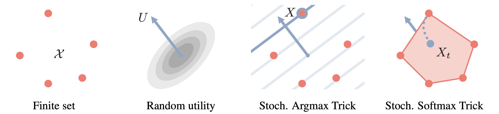

# Gradient Estimation with Stochastic Softmax Tricks

This repository contains the official PyTorch implementation of [Gradient Estimation with Stochastic Softmax Tricks](https://arxiv.org/abs/2006.08063).



This repository contains code to reproduce the NRI for Graph Layout experiments, and includes:
* Spanning tree SST with exponential family entropy relaxation
* Spanning tree SMT (batched pytorch and C++ implemenation of Kruskal's algorithm)
* Top k SST with exponential family entropy relaxation
* Directed spanning tree SMT (C++ implementation of Chu–Liu/Edmonds' algorithm)

### Requirements
* Pytorch 1.4
* Python 3.7
* CVXPY (`pip install cvxpy`)
* cvxpylayers (`pip install cvxpylayers`)
* NetworkX (`pip install networkx`)

### Compile C++ Kruskals
To import `core/kruskals/kruskals.py` the C++ Kruskal's algorithm implementation must be compiled and installed:
```
cd core/kruskals
python setup_kruskals.py install
```

### Data generation
The graph layout data can be generated using the script `data_scipts/generate_graph_layout_dataset.py`. To generate the exact data used in the experiments of the paper, run:
```
python -m data_scripts.generate_graph_layout_dataset --num_timesteps 10 --num_vertices 10
python -m data_scripts.generate_graph_layout_dataset --num_timesteps 20 --num_vertices 10
```

### Training

To reproduce the spanning tree SST results for T=10, run: 
```
python train.py --suffix _novar_1skip_10t_1r_graph10 --timesteps 10 \
--prediction_steps 9 --sst tree --relaxation exp_family_entropy \
--max_range 15 --symmeterize_logits True 
```
and tune `--lr`, `--temp` by doing random uniform search in the log scale over a hypercube-shaped search space.

To reproduce the topk SST results for T=10, run:
```
python train.py --suffix _novar_1skip_10t_1r_graph10 --timesteps 10 \
--prediction_steps 9  --sst topk --relaxation exp_family_entropy \
--symmeterize_logits True 
```
and tune `--lr`, `--temp` by doing random uniform search in the log scale over a hypercube-shaped search space, and random search for `--eps_for_finitediff` over [1e0, 1e-1, 1e-2, 1e-3, 1e-4].

To reproduce the independent edges results for T=10, run:
```
python train.py --suffix _novar_1skip_10t_1r_graph10 --timesteps 10 \
--prediction_steps 9 --sst indep --symmeterize_logits False
```
and tune `--lr`, `--temp` by doing random uniform search in the log scale over a hypercube-shaped search space.

To reproduce the spanning tree SST results for T=20, replace the above commands with `--suffix _novar_1skip_20t_1r_graph10 --timesteps 20 --prediction_steps 10`.


### Cite
If you use this code for your research, please cite our paper:
```
@article{paulus2020gradient,
  title={Gradient Estimation with Stochastic Softmax Tricks},
  author={Paulus, Max B and Choi, Dami and Tarlow, Daniel and Krause, Andreas and Maddison, Chris J},
  journal={Advances in Neural Information Processing Systems},
  year={2020}
}
```
